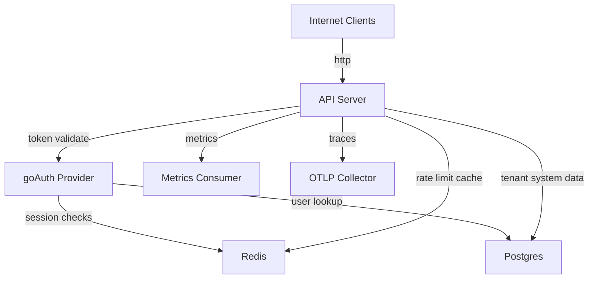

# API Threat Model (SuperAPI Template)

## Assumption validation check-in (provisional)
- The API is internet reachable behind a reverse proxy/load balancer.
- This template will be reused by multiple teams, so secure defaults matter more than local-dev convenience.
- Tenant and user data are considered sensitive business data.
- Authenticated endpoints are expected to enforce revocation quickly for high-risk actions.
- Redis and Postgres may run on separate hosts/networks, not guaranteed localhost-only.

Targeted context questions that can change risk ranking:
1. Will production traffic ever run with `APP_ENV` unset or set to non-`production`?
2. Are `/metrics` and `/readyz` exposed only inside a private network, or publicly reachable?
3. Is strict revocation enforcement required (for example: account suspension must cut off access immediately)?

## Executive summary
Top risk themes are insecure-by-misconfiguration defaults (`APP_ENV=dev`, optional metrics auth, fail-open controls), exposed unauthenticated reference routes, and auth/session posture drift (`hybrid`/`jwt_only` and implicit goAuth defaults). The highest-risk areas are route policy attachment, runtime env hardening, and dependency transport/auth settings for Redis/Postgres.

## Scope and assumptions

In scope:
- Runtime API bootstrap and middleware:
  - `cmd/api/main.go`
  - `internal/core/app/app.go`
  - `internal/core/httpx/*`
  - `internal/core/config/config.go`
- Security policies and auth/rate-limit/cache logic:
  - `internal/core/policy/*`
  - `internal/core/auth/*`
  - `internal/core/ratelimit/*`
  - `internal/core/cache/*`
- Default module routes:
  - `internal/modules/modules.go`
  - `internal/modules/system/routes.go`
  - `internal/modules/health/routes.go`
- Operational docs and CI:
  - `docs/environment-variables.md`
  - `docs/auth-goauth.md`
  - `docs/workflows.md`
  - `.github/workflows/ci.yml`

Out of scope:
- Infrastructure/network policy implementation outside this repo.
- Internal security guarantees of external dependencies (for example goAuth internals).
- Deployment platform IAM, secret manager policy, WAF, and edge TLS termination details.

Open questions that materially affect ranking:
- Whether metrics/readiness are internet exposed or private only.
- Whether custom business modules will expose public routes by default in downstream projects.
- Whether revoked-token access in degraded Redis conditions is acceptable.

## System model
### Primary components
- Internet clients call a single HTTP server created in `internal/core/app/app.go:57-65`.
- Global middleware stack is assembled in `internal/core/httpx/globalmiddleware.go:26-48`.
- Default modules registered by `internal/modules/modules.go:13-15` expose health and system routes.
- Optional dependencies are wired in `internal/core/app/deps.go:42-159`:
  - Postgres (`internal/core/db/postgres.go:14-31`)
  - Redis (`internal/core/cache/redis.go:14-27`)
  - Metrics (`internal/core/metrics/metrics.go`)
  - Tracing (`internal/core/tracing/service.go`)
  - goAuth provider (`internal/core/auth/goauth_provider.go:61-84`)

### Data flows and trust boundaries
- Internet -> API server
  - Data: headers, JSON bodies, route/query params, bearer tokens
  - Channel: HTTP
  - Security controls: request ID, recoverer, optional CORS/security headers, body limits, optional request timeout (`internal/core/httpx/globalmiddleware.go:29-47`, `internal/core/httpx/maxbody.go:9-10`, `internal/core/httpx/requesttimeout.go:14-28`)
  - Validation: strict JSON decode for typed handlers (`internal/core/httpx/typedjson.go:78-90`)

- API server -> Auth provider (goAuth + Redis + Postgres)
  - Data: bearer token, user/session metadata
  - Channel: in-process calls + Redis/Postgres network calls
  - Security controls: mode parsing/selection (`internal/core/auth/provider.go:26-34`), uniform unauthorized responses (`internal/core/policy/auth.go:23-31`)
  - Gap: explicit JWT issuer/audience/key config not surfaced in this repo (`internal/core/auth/goauth_provider.go:66-70`)

- API server -> Redis (rate-limit/cache/session)
  - Data: rate-limit keys, cache payloads, session validation data
  - Channel: Redis TCP client (`internal/core/cache/redis.go:14-22`)
  - Security controls: timeouts + startup ping (`internal/core/cache/redis.go:18-27`)
  - Gap: no explicit TLS configuration in redis client options.

- API server -> Postgres
  - Data: tenant/user records, password hashes
  - Channel: pgx pool from DSN (`internal/core/db/postgres.go:14-22`)
  - Security controls: pool bounds + startup ping (`internal/core/db/postgres.go:19-31`)
  - Gap: DSN security posture (`sslmode`) not enforced by lint.

- API server -> Monitoring/telemetry consumers
  - Data: metrics, traces, readiness state
  - Channel: `/metrics`, `/readyz`, OTLP gRPC
  - Security controls: optional bearer auth for metrics if token set (`internal/core/app/app.go:45-49,92-112`), readiness error sanitization (`internal/core/readiness/service.go:85-89`)
  - Gap: metrics token only mandatory in prod env classification (`internal/core/config/config.go:414-416`).

#### Diagram

## Assets and security objectives

| Asset | Why it matters | Security objective (C/I/A) |
|---|---|---|
| Bearer tokens and session validity | Token misuse enables account takeover and lateral movement | C, I |
| Tenant records (`tenants` table) | Core multi-tenant business metadata | C, I |
| User table (`users`, `password_hash`) | Credential artifacts and authorization claims | C, I |
| Rate-limit enforcement state | Protects authentication and API surfaces from abuse | A, I |
| Cache contents and cache keying behavior | Can leak or corrupt user-visible responses | C, I |
| Metrics/readiness telemetry | Operational internals useful for attacker recon | C |
| Config/env values | Determine auth mode, fail-open behavior, and exposure posture | I, A |
| Build pipeline trust | Compromised CI tools can tamper artifacts | I |

## Attacker model
### Capabilities
- Remote unauthenticated internet attacker can call any publicly routed endpoint.
- Authenticated low-privilege attacker can replay valid tokens and probe authz gaps.
- Network-adjacent attacker may observe or influence traffic if DB/cache transport is not encrypted.
- Opportunistic bot can exploit fail-open windows during Redis faults.
- Supply-chain adversary can target CI tool downloads if integrity controls are weak.

### Non-capabilities
- No assumption of direct shell access on API host.
- No assumption attacker controls Postgres/Redis directly unless misconfigured/exposed.
- No assumption of browser-cookie auth CSRF risk for route auth, because route policy uses bearer header (`internal/core/policy/auth.go:23`, `192-201`).

## Entry points and attack surfaces

| Surface | How reached | Trust boundary | Notes | Evidence (repo path / symbol) |
|---|---|---|---|---|
| `POST /system/parse-duration` | Public JSON endpoint | Internet -> API | Strict JSON decode, still publicly callable | `internal/modules/system/routes.go:35`, `internal/core/httpx/typedjson.go:78-90` |
| `GET /api/v1/system/whoami` | Authenticated route | Internet -> API -> goAuth | Auth + rate-limit policy attached | `internal/modules/system/routes.go:38-41` |
| `GET /healthz`, `GET /readyz` | Public HTTP route | Internet -> API -> dependency checks | Readiness exposes dependency state (sanitized message) | `internal/modules/health/routes.go:12-13`, `internal/core/readiness/service.go:71-74` |
| `GET /metrics` | Conditionally protected route | Internet -> API | Token check only applied if `METRICS_AUTH_TOKEN` is set | `internal/core/app/app.go:45-49,92-112` |
| Env-based config loading | Process env at startup | Operator/env -> API | Security posture depends heavily on env correctness | `internal/core/config/config.go:142-243` |
| CI dependency/tool install | GitHub Actions workflow | CI runner -> internet | Raw script + `@latest` installs increase supply-chain risk | `.github/workflows/ci.yml:32,39,45` |

## Top abuse paths

1. Unauthenticated custom-route tampering
  1. Attacker discovers a module route exposed without auth policies.
  2. Sends unauthenticated write requests.
  3. Mutates application data outside intended authz boundaries.
  4. Impact: data integrity loss and business logic abuse.

2. Unauthenticated custom-route data harvesting
  1. Attacker calls public list/detail module routes.
  2. Iterates or scrapes sensitive metadata.
  3. Uses data for phishing/recon and follow-on targeting.

3. Revoked-token reuse in degraded mode
   1. Token is revoked server-side.
   2. Service runs in `hybrid` mode during Redis outage (or `jwt_only` mode).
   3. Token continues to pass JWT validation until expiry.
   4. Impact: delayed revocation enforcement.

4. Abuse burst during Redis outage
   1. Redis becomes unavailable.
   2. `RATELIMIT_FAIL_OPEN=true` allows traffic through.
   3. Attacker floods expensive/auth endpoints.
   4. Impact: availability degradation and brute-force window.

5. Cross-user cache leakage by misconfigured authenticated caching
   1. Developer sets `AllowAuthenticated=true` without `VaryBy.UserID/TenantID`.
   2. User A primes cache with personalized response.
   3. User B receives A's cached payload.
   4. Impact: cross-user data disclosure.

6. Observability endpoint reconnaissance
   1. Attacker queries `/metrics` or `/readyz`.
   2. Learns dependency state, route patterns, and load/error shape.
   3. Tunes attacks to weak dependencies/timing windows.

7. Transport interception of backend traffic
   1. Operator configures non-TLS DB/cache channels (`sslmode=disable`, no Redis TLS).
   2. Network attacker sniffs/modifies backend traffic.
   3. Impact: credential leakage and data tampering.

8. CI toolchain poisoning
   1. Adversary compromises upstream script/tag used by CI install steps.
   2. Malicious binary/script runs in workflow.
   3. Impact: build artifact tampering and secret exposure in CI context.

## Threat model table

| Threat ID | Threat source | Prerequisites | Threat action | Impact | Impacted assets | Existing controls (evidence) | Gaps | Recommended mitigations | Detection ideas | Likelihood | Impact severity | Priority |
|---|---|---|---|---|---|---|---|---|---|---|---|---|
| TM-001 | Internet unauth attacker | Public custom module routes exposed without auth policies | Create/read module data without auth | Unauthorized write/read of application data | Module-owned data, service integrity | Policy framework exists (`internal/core/policy/auth.go`, `internal/core/policy/policy.go`) | Template cannot force policy attachment on every custom route | Add `AuthRequired`/RBAC policy baseline to custom route templates and review gates | Alert on anonymous write traffic by route pattern; baseline per-route auth metrics | Medium | High | high |
| TM-002 | Misconfiguration + external probing | `APP_ENV` unset/non-prod in production | Service runs with weaker default posture | Broader attack surface and weaker telemetry transport posture | Config integrity, observability data | Config lint exists (`internal/core/config/config.go:254+`) | `APP_ENV` defaults to `dev`; security headers default off outside prod (`internal/core/config/config.go:143,163`) | Enforce `APP_ENV=production` in deployment policy; add startup hard-fail if internet-facing and not prod env | Startup config audit logs + deployment policy checks | Medium | High | high |
| TM-003 | Internet attacker | Metrics path reachable and token unset | Scrape `/metrics` for route/load/dependency intel | Recon for targeted DoS and attack timing | Operational telemetry | Optional token guard (`internal/core/app/app.go:46-49`) | Token is optional unless env classed as prod (`internal/core/config/config.go:414-416`) | Require metrics auth token in all non-local envs; network-restrict metrics path | Alert on unknown principals hitting `/metrics`; anomaly on scrape origin | High | Medium | high |
| TM-004 | Token holder with revoked session | `AUTH_MODE=jwt_only` or `hybrid` under Redis outage | Continue API access using revoked token until JWT expiry | Revocation bypass window | Auth/session artifacts | Auth middleware present (`internal/core/policy/auth.go:23-31`) | `hybrid` fallback behavior documented (`docs/auth-goauth.md:66-68`) | Use `strict` mode for sensitive endpoints; shorten JWT TTL; add emergency denylist checks | Monitor auth successes during Redis degraded state | Medium | High | high |
| TM-005 | Internet attacker during dependency fault | Redis unavailable + `RATELIMIT_FAIL_OPEN=true` | Bypass throttling and flood endpoints | Availability degradation, brute-force window | Availability-critical resources | Rate-limit middleware exists (`internal/core/policy/ratelimit.go`) | Fail-open default true (`internal/core/config/config.go:199`, `docs/environment-variables.md:101`) | Set fail-open false for sensitive routes; isolate auth limiter; add circuit breakers | Alert on `OutcomeFailOpen` spikes (`internal/core/ratelimit/ratelimit.go:37,143-156`) | Medium | High | high |
| TM-006 | Authenticated low-priv attacker | Misconfigured cache on personalized route | Prime/poison shared authenticated cache key | Cross-user or cross-tenant data disclosure | Cached API payloads | Cache bypass for auth unless configured (`internal/core/policy/cache.go:223-239`) | `AllowAuthenticated=true` does not force user/tenant vary (`internal/core/cache/manager.go:164`, `internal/core/policy/cache.go:235`) | Add hard validation: if `AllowAuthenticated`, require `VaryBy.UserID` or `VaryBy.TenantID`; add safe defaults | Log cache set/hit with auth scope marker and detect shared-key anomalies | Medium | High | high |
| TM-007 | Network-adjacent attacker | Backend traffic not protected with TLS | Sniff/alter Redis/Postgres traffic | Credential theft and data tampering | DB/cache credentials and data | Timeout/ping checks only (`internal/core/cache/redis.go:18-27`, `internal/core/db/postgres.go:29-31`) | No Redis TLS config in client options; no lint enforcement of secure Postgres sslmode | Add Redis TLS env controls; enforce secure Postgres sslmode in lint; remove `sslmode=disable` docs/examples | Network IDS + config conformance checks for DSN/TLS | Medium | High | high |
| TM-008 | Auth forging/validation confusion attacker | goAuth defaults unsuitable or inconsistent across services | Exploit weak/implicit JWT validation config | Auth bypass or trust boundary confusion | Auth integrity | goAuth validation exists (`internal/core/auth/goauth_provider.go:31-55`) | App uses `goauth.DefaultConfig()` with minimal explicit hardening (`internal/core/auth/goauth_provider.go:66-70`, `docs/auth-goauth.md:238`) | Surface explicit JWT issuer/audience/key env vars; fail startup if absent when auth enabled | Auth failure reason dashboards + token claim conformance checks | Medium | High | high |
| TM-009 | Internet attacker + operator misconfig | Over-broad trusted proxies or CORS allowlist | Spoof client IP / overexpose browser origins | Rate-limit evasion, broader cross-origin access | Abuse controls, data confidentiality | Trusted proxy parsing + CORS lint exists (`internal/core/config/config.go:294-312,800-818`) | Misconfiguration remains possible; wildcard origin still allowed when credentials false | Enforce deployment guardrails for proxy CIDRs and CORS origins; add config policy tests | Alert on sudden client-IP entropy shifts and unexpected origins | Medium | Medium | medium |
| TM-010 | Supply-chain attacker | CI workflow internet installs from mutable sources | Execute malicious tool/script in CI | Artifact tampering and CI secret compromise | Build integrity, release artifacts | CI includes race/lint/vuln checks (`.github/workflows/ci.yml:28,39`) | Raw install script and `@latest` usage (`.github/workflows/ci.yml:32,39,45`) | Pin tool versions and checksums; avoid piping raw scripts directly; use verified actions | Monitor CI provenance and dependency diff alerts | Low | High | medium |
| TM-011 | Internet recon attacker | Readiness endpoint publicly reachable | Probe dependency status (`ok/error`) to time attacks | Better attack planning and outage amplification | Operational secrecy | Error text sanitized (`internal/core/readiness/service.go:85-89`) | Dependency names/status still publicly available (`internal/modules/health/routes.go:13`) | Restrict `/readyz` to internal network or authenticated operators | Alert on high-frequency `/readyz` probing from unknown sources | Medium | Low | low |

## Criticality calibration

For this repo/context:
- `critical`: Remote abuse can directly alter tenant/user data or bypass core auth assumptions with minimal prerequisites.
  - Example: anonymous write/read access on a custom business-critical route (TM-001).
  - Example: authenticated cache misconfiguration causing cross-user leakage at scale (TM-006).
- `high`: Serious confidentiality/integrity/availability impact, but requires outage/misconfig or specific deployment posture.
  - Example: metrics + dev posture exposure (TM-002/TM-003).
  - Example: revocation bypass in non-strict auth modes (TM-004).
  - Example: non-TLS DB/cache transport interception (TM-007).
- `medium`: Material risk with stronger preconditions or narrower blast radius.
  - Example: proxy/CORS misconfiguration enabling evasion/exposure (TM-009).
  - Example: CI supply-chain drift in tooling install path (TM-010).
- `low`: Useful attacker recon or weak impact alone.
  - Example: readiness status probing without deeper compromise (TM-011).

## Focus paths for security review

| Path | Why it matters | Related Threat IDs |
|---|---|---|
| `internal/modules/modules.go` | Controls which modules/routes are active by default | TM-001 |
| `internal/core/config/config.go` | Security posture defaults and lint guardrails are centralized here | TM-002, TM-003, TM-005, TM-009 |
| `internal/core/app/app.go` | Metrics registration and auth wrapping behavior | TM-003 |
| `internal/core/policy/auth.go` | Bearer auth enforcement boundary and authz policy chain | TM-004 |
| `internal/core/auth/goauth_provider.go` | Implicit goAuth default configuration and validation mode | TM-004, TM-008 |
| `docs/auth-goauth.md` | Documents fallback behavior and default auth mode expectations | TM-004, TM-008 |
| `internal/core/ratelimit/ratelimit.go` | Fail-open decisions and rate-limit key design | TM-005 |
| `internal/core/policy/ratelimit.go` | User-facing behavior when limiter errors or blocks | TM-005 |
| `internal/core/cache/manager.go` | Auth cache key composition and `AllowAuthenticated` behavior | TM-006 |
| `internal/core/policy/cache.go` | Cache bypass vs set logic for authenticated traffic | TM-006 |
| `internal/core/cache/redis.go` | Redis connection security and transport options | TM-007 |
| `internal/core/db/postgres.go` | DB connection configuration and lack of sslmode enforcement | TM-007 |
| `docs/workflows.md` | Insecure DSN examples can normalize unsafe deployments | TM-007 |
| `.github/workflows/ci.yml` | CI integrity risk from mutable tool install strategy | TM-010 |
| `internal/modules/health/routes.go` | Readiness route exposure and disclosure tradeoffs | TM-011 |
| `internal/core/readiness/service.go` | Readiness report content and sanitization behavior | TM-011 |

## Detailed threat narratives and fixes

### TM-001: Unauthenticated custom-route exposure
Threat description:
- Custom modules can still expose unauthenticated read/write routes if policies are omitted during route registration.
- This remains a direct integrity and confidentiality risk for deployments that rely on implicit auth assumptions.

Possible fixes:
- Require authentication for all sensitive module routes by default:
  - Add `policy.AuthRequired(...)` on list/create/get routes.
  - Add tenant and role/permission policies where applicable (`policy.TenantRequired`, `policy.RequireRole`, `policy.RequirePerm`).
- Add route-level rate limits for write endpoints.
- Keep public routes opt-in, not default.

### TM-002: Production deployed with dev posture
Threat description:
- `APP_ENV` defaults to `dev` (`internal/core/config/config.go:143`). Non-prod env defaults disable security headers (`internal/core/config/config.go:163`) and default tracing transport to insecure (`internal/core/config/config.go:146,243`).
- If operators omit `APP_ENV=production`, service posture can silently weaken in real environments.

Possible fixes:
- Enforce startup failure when running in known production environments without `APP_ENV=production`.
- Add deployment policy checks (Helm/Kustomize/Terraform CI) that reject non-prod env values for prod targets.
- Consider switching template default from `dev` to explicit required value in non-local deployments.

### TM-003: Metrics endpoint reconnaissance exposure
Threat description:
- Metrics endpoint is enabled by default (`internal/core/config/config.go:232`, `docs/environment-variables.md:160`).
- Bearer auth for metrics is only attached if `METRICS_AUTH_TOKEN` is non-empty (`internal/core/app/app.go:46-49`). Token is only lint-required in prod env classification (`internal/core/config/config.go:414-416`).
- Publicly reachable unauth metrics can leak route patterns, rates, dependency state, and saturation indicators.

Possible fixes:
- Require `METRICS_AUTH_TOKEN` in every non-local environment, not only prod.
- Move metrics to internal-only network exposure.
- Optionally disable metrics (`METRICS_ENABLED=false`) if not scraped.

### TM-004: Revocation bypass in `jwt_only`/`hybrid` operation
Threat description:
- Route auth checks bearer tokens via provider (`internal/core/policy/auth.go:23-31`), and auth mode accepts `jwt_only`, `hybrid`, `strict` (`internal/core/auth/provider.go:17-34`).
- Documented behavior: hybrid can fall back to JWT-only if Redis is unavailable (`docs/auth-goauth.md:66-68`), allowing revoked session tokens to continue until JWT expiry.

Possible fixes:
- Use `strict` for sensitive routes (admin, tenant mutations, account/security operations).
- Use short JWT expiry with refresh rotation.
- Add explicit degraded-mode policy: fail closed for selected route groups when Redis health is bad.

### TM-005: Rate-limit bypass when Redis fails
Threat description:
- Default `RATELIMIT_FAIL_OPEN=true` (`internal/core/config/config.go:199`, `docs/environment-variables.md:101`).
- Limiter explicitly allows requests on Redis script errors when fail-open is enabled (`internal/core/ratelimit/ratelimit.go:143-146,155-157`).
- Attackers can intentionally exploit outage windows to increase request pressure and brute-force attempts.

Possible fixes:
- Set `RATELIMIT_FAIL_OPEN=false` for internet-facing auth-sensitive endpoints.
- Use layered controls (gateway-level limits + app limits).
- Alert on `fail_open` outcome spikes to trigger incident response.

### TM-006: Authenticated cache keying misuse can leak user data
Threat description:
- Cache policy bypasses authenticated traffic unless configured otherwise (`internal/core/policy/cache.go:223-239`).
- If developer sets `AllowAuthenticated=true`, key only adds `auth=allowed` marker (`internal/core/cache/manager.go:164`) unless explicit user/tenant vary fields are enabled.
- This can create shared cache entries across authenticated users on personalized endpoints.

Possible fixes:
- Add config validation: if `AllowAuthenticated=true`, require `VaryBy.UserID` or `VaryBy.TenantID`.
- Add explicit negative tests for cross-user cache isolation.
- Keep authenticated caching disabled by default for response bodies containing user-specific fields.

### TM-007: Backend transport security not enforced
Threat description:
- Postgres connection security is delegated to DSN parse only (`internal/core/db/postgres.go:14`) with no lint check for secure sslmode.
- Redis client config sets addr/password/timeouts but no TLS config (`internal/core/cache/redis.go:14-22`).
- Docs and CLI usage include `sslmode=disable` examples (`cmd/migrate/main.go:275`, `docs/auth-goauth.md:28`, `docs/workflows.md:21`), increasing likelihood of insecure deployment carryover.

Possible fixes:
- Add lint rule enforcing secure Postgres `sslmode` in prod.
- Add Redis TLS env vars and wire `TLSConfig` when enabled.
- Replace `sslmode=disable` examples with secure defaults and local-dev overrides clearly labeled.

### TM-008: Implicit goAuth default crypto posture
Threat description:
- Provider is built from `goauth.DefaultConfig()` with only validation mode/result fields adjusted (`internal/core/auth/goauth_provider.go:66-70`).
- There is no explicit repo-level env wiring for issuer/audience/key source, which creates uncertainty and cross-service inconsistency risk (inference based on visible code paths).

Possible fixes:
- Surface explicit JWT trust config env vars (issuer, audience, JWKS/public keys, acceptable algorithms, clock skew).
- Fail startup when auth is enabled and required trust config is missing.
- Add integration tests that reject tokens with wrong issuer/audience/key.

### TM-009: Proxy/CORS misconfiguration risk
Threat description:
- Client IP trust depends on operator-supplied trusted proxies (`internal/core/httpx/clientip.go:15-25`), and bad proxy CIDRs can make forwarded headers attacker-controlled.
- CORS has validation and wildcard+credentials guardrails (`internal/core/config/config.go:294-312`), but broad allowlists still expand exposure.

Possible fixes:
- Enforce infra policy tests for trusted proxy CIDR exactness.
- Keep CORS disabled by default; if enabled, require explicit origin allowlists.
- Add startup warnings for wildcard origins in internet deployments.

### TM-010: CI supply-chain drift in tool installation
Threat description:
- CI installs linters/tools via raw script and `@latest` (`.github/workflows/ci.yml:32,39,45`).
- Mutable install sources increase risk of compromised tool execution in CI and non-reproducible builds.

Possible fixes:
- Pin exact versions and checksums for downloaded tools.
- Prefer trusted prebuilt actions/containers with immutable digests.
- Add provenance/signature verification for CI-generated artifacts.

### TM-011: Readiness endpoint supports attacker recon
Threat description:
- `/readyz` is public by default (`internal/modules/health/routes.go:13`) and returns per-dependency status names.
- Messages are sanitized (`internal/core/readiness/service.go:85-89`), but dependency state still helps attackers time fault-amplification attempts.

Possible fixes:
- Restrict `/readyz` to private networks or authenticated operators.
- Keep `/healthz` public for liveness, with `/readyz` internal-only.
- Add access monitoring for readiness probe anomalies.

## Quality check
- All discovered runtime entry points are covered: yes (`/system`, `/healthz`, `/readyz`, `/metrics`).
- Each major trust boundary represented in threats: yes (internet/API, API/auth, API/Redis, API/Postgres, API/telemetry, CI/internet).
- Runtime vs CI/dev separation: yes (TM-001..TM-009 runtime, TM-010 CI, docs/config misconfiguration separately tracked).
- Assumptions and open questions explicit: yes (top section + scope/open questions).
